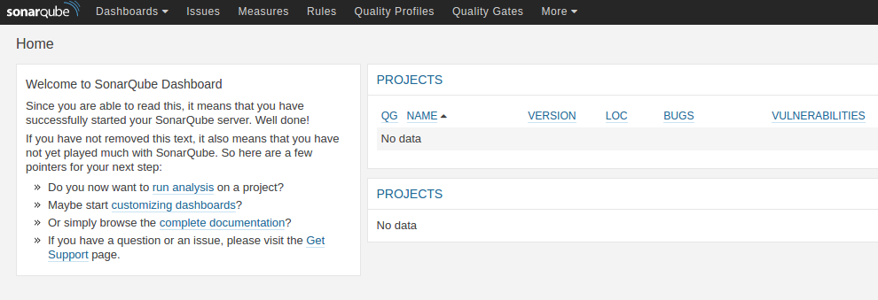
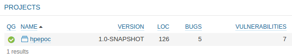
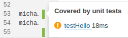

# Governance POC
============

The purpose of this project is to demonstrate the ability to improve test automation reliability,
by employing Sonarqube code coverage capabilities.


Installing Sonarqube
--------------------

Download Sonarqube from the following link:
https://sonarsource.bintray.com/Distribution/sonarqube/sonarqube-5.5.zip

Unzip the SonarQube distribution (let's say in "C:\sonarqube" or "/etc/sonarqube")

On Windows, execute:
C:\sonarqube\bin\windows-x86-xx\StartSonar.bat

On other operating system, execute:
/etc/sonarqube/bin/[OS]/sonar.sh console

Navigate to <http://127.0.0.1:9000>

You will see SonarQube main dahboard


Clone and Run the project
------------------------------

The following instructions assume that you have [git](https://git-scm.com/downloads) and [gradle](http://gradle.org/gradle-download/) installed.

Clone the repo ```git clone git@github.com:hammon/hpepoc.git```

Execute ```gradle clean test sonarRunner``` from the project home directory

Refresh SonarQube console at <http://127.0.0.1:9000>

You will see hpepoc project in the dashboard:


Execute ```git diff  master..testContent src/main/java/TestServlet.java```

You will see output similar to this:

```
diff --git a/src/main/java/TestServlet.java b/src/main/java/TestServlet.java
index 1dc45e0..121daf1 100644
--- a/src/main/java/TestServlet.java
+++ b/src/main/java/TestServlet.java
@@ -50,7 +50,7 @@ public class TestServlet extends HttpServlet {
             out.print(request.getParameter("content"));
         }
         else{
-            out.print("Hello!");
+            out.print("Hello test content!");
         }
     }
```
Now we want to know which test affected by this change.
In order to do this, run ```gradle executeDetector``` from terminal.

You will see details about test that affected by this change:
```
src/main/java/TestServlet.java - changed line: 53
{
  "durationInMs": 22,
  "fileName": "src/test/java/TestApi.java",
  "name": "testHello",
  "fileKey": "michael:hpepoc:src/test/java/TestApi.java",
  "id": "AVTpHq7X5pffP_9Ci88d",
  "fileId": "AVTpHqQ35pffP_9Ci86L",
  "status": "OK",
  "coveredLines": 32
}
```

Note that we still on 'master' branch and did not executed anything on 'testContent' branch.

Execute ```git checkout testContent```

The 'testContent' branch contains a minor change that causes one of the tests to fail.

Execute ```gradle clean test sonarRunner``` again.

If at this stage you will rerun ```gradle executeDetector``` 

You will see slightly different output:
```
src/main/java/TestServlet.java - changed line: 53
{
  "durationInMs": 18,
  "fileName": "src/test/java/TestApi.java",
  "name": "testHello",
  "fileKey": "michael:hpepoc:src/test/java/TestApi.java",
  "id": "AVTpNXEC5pffP_9Ci88k",
  "message": "java.lang.AssertionError: expected [Hello!] but found [Hello test content!]",
  "fileId": "AVTpHqQ35pffP_9Ci86L",
  "status": "FAILURE",
  "coveredLines": 32
}
```

Coverage by unit test also available from SonarQube UI




